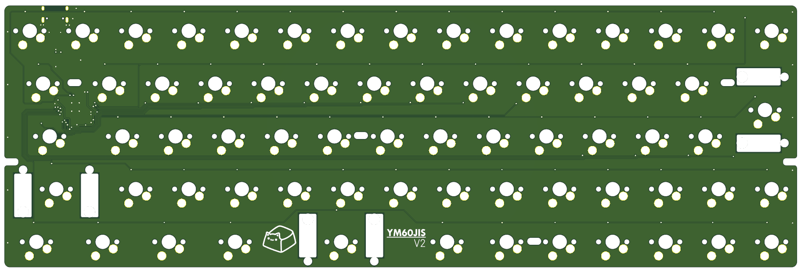
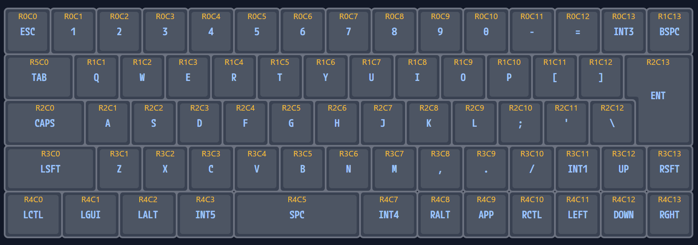

# YM60JISv2

The successor to the YM60JIS. A 60% PCB supporting both MX and Gateron Low Profile 3.0 compatible switches with universal tray mount case.

## Default Layout

You can also customize the layout using [Vial](https://get.vial.today/).

## Build Guide

See [Build Guide](https://ymkn.github.io/buildguide/ym60jisv2.html).

## License

This project is licensed under the MIT License, see the [LICENSE file](LICENSE) for details.

However, this does not apply to logo data (image files, KiCAD footprints, etc.) included in the resources of this project.
